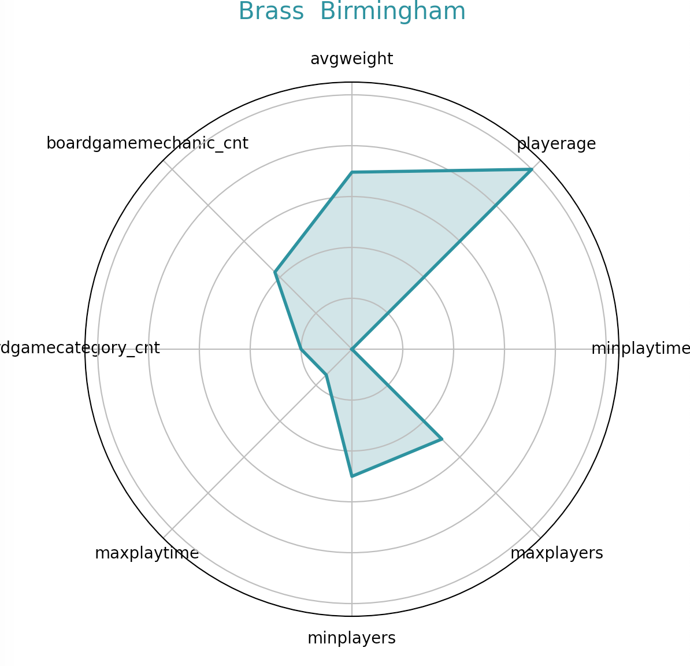

# Board Game Analysis

## Overview
This repository contains an in-depth analysis of board game data scraped from BoardGameGeek.com. The dataset includes attributes of 20,000 board games based on January 13th, 2020. The project encompasses data wrangling (ETL, cleaning, transforming, etc.), exploratory data analysis, and applying several machine learning techniques to derive insights from the board game industry and understand the landscape of board games.

## Motivation
As an avid board game enthusiast with aspirations to design and create board games in the future, I undertook this project with two primary goals:

1. To hone my machine learning and data analysis skills, applying various techniques to a real-world dataset.
2. To gain deep insights into the board game market and understand the factors contributing to a game's success and popularity.

This project serves as a learning exercise in data science and a strategic analysis of the board game industry. By understanding market trends, popular mechanics, and factors influencing game complexity and popularity, I aim to inform my future game design endeavors and contribute meaningfully to the board game community.

## Dataset
The primary dataset is 'boardgame.csv', which includes the following key features:
- Game name and ID
- Year published
- Minimum and maximum players
- Playtime
- Age requirements
- User ratings and complexity scores
- Various count metrics (e.g., number of ratings, comments, etc.)
- Game categories, mechanics, and designer information

## Project Structure
1. **Data Wrangling**: 
   - Handling missing data
   - Removing duplicates
   - Feature scaling
   - Feature engineering
   - Exporting cleaned data to a new CSV file

2. **Anomaly Detection**:
   - Goal: Identify outlier games in terms of complexity or playtime
   - Method: DBSCAN 

3. **Popularity Classification**:
   - Goal: Classify games into popularity categories (high, medium, low)
   - Method: Naive Bayes
   - Features used: numgeeklists, numwanting, siteviews

4. **Market Basket Analysis**:
   - Goal: Analyze common combinations of designers and mechanics in successful games
   - Method: Association rule mining

5. **Game Clustering**:
   - Goal: Group games based on complexity and playtime
   - Method: K-means clustering

6. **Time Series Analysis**:
   - Goal: Analyze trends in game complexity over time
   - Method: ARIMA modeling

7. **Complexity Prediction**:
   - Goal: Predict game complexity (avgweight) based on various features
   - Method: Random Forests regression

## Requirements
- Python 3.x
- Libraries: pandas, numpy, sklearn, matplotlib, seaborn, mlxtend, statsmodels

## Results
Key findings and visualizations from each analysis are included in the respective notebooks. Highlights include:
- Identification of anomalous games
- Popularity classification accuracy
- Common designer-mechanic combinations
- Clusters of games based on complexity and playtime
- Trends in game complexity over time
- Factors influencing game complexity

  The results are in the pdf file. 

## Future Work
- Incorporate more recent data to analyze current trends
- Explore deep learning approaches for game recommendation systems
- Analyze the impact of expansions on game popularity
- Apply insights to personal game design projects

## Acknowledgments
- BoardGameGeek.com for the original data

I also added spiderplot.py to see the spider plot of the top ten board games. 

[]

